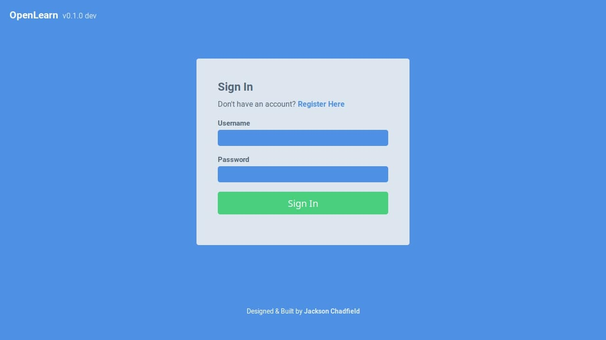
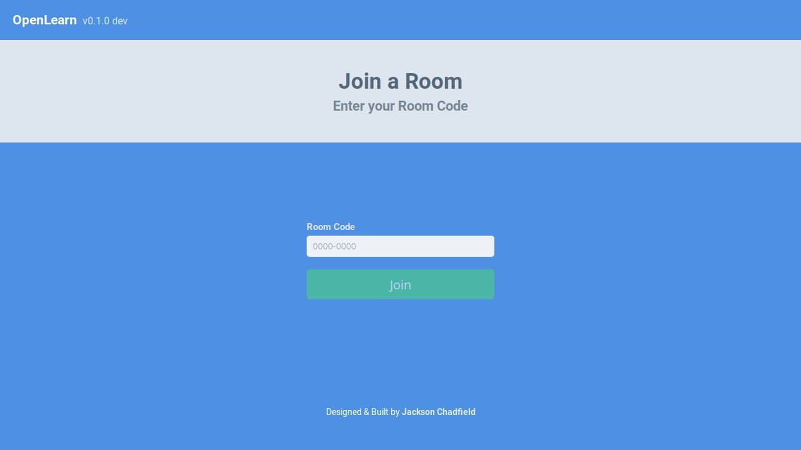

<h3 align="center">OpenLearn</h3>

<div align="center">

  []() 
  [](https://github.com/j-chad/OpenLearn/issues)
  [](https://github.com/j-chad/OpenLearn/pulls)
  [](/LICENSE)

</div>

---

<p align="center">
    Open source platform for collaborative learning
    <br> 
</p>

## Table of Contents
- [About](#about)
- [Getting Started](#getting_started)
- [Built Using](#built_using)
- [Screenshots](#screenshots)

## About <a name = "about"></a>
The idea for this project came from the realisation that there is no decent
learning platforms that respect the users privacy. This is an attempt to
provide an alternative service which can be used at no cost.

Currently, this project is in the concept stage. Some work has been started but I do not
expect that I will be able to put much time towards this project in the near future.

## Getting Started <a name = "getting_started"></a>
These instructions will get you a copy of the project up and running on your local machine for development and testing purposes. See [deployment](#deployment) for notes on how to deploy the project on a live system.

### Prerequisites
* [Python 3](https://python.org) (tested on python 3.7.4)
* [Poetry](https://poetry.eustace.io/)  for package management
* [PostgreSQL](https://www.postgresql.org/download/) database

### Installing
Clone this repo
```
git clone https://github.com/j-chad/OpenLearn
cd OpenLearn/
```
Install dependencies with poetry
```
poetry install
poetry shell
```

### Configuration
Before we can run the application, we need to create configuration files.
**Nothing in the `instance` folder should be committed to git**
```
mkdir instance
touch instance/config.cfg
touch instance/testing.cfg
```
Modify these file to set configuration options. 
Production and Development environments will use `config.cfg` while 
Testing environments use `testing.cfg`.

Files should have the format: `KEY="VALUE"` with each pair being on it's own line.

| Key                     | Value                                                                                                                  | Required |
|-------------------------|------------------------------------------------------------------------------------------------------------------------|----------|
| SQLALCHEMY_DATABASE_URI | [URI of your database](https://docs.sqlalchemy.org/en/13/dialects/postgresql.html#dialect-postgresql-psycopg2-connect) | Yes      |
| SECRET_KEY              | secret value. Generate with CSRNG                                                                                      |          |

For the majority of the time you will want to be running in a development environment
```
export FLASK_ENV=development
```

### Running
Begin by building the database (you only need to do this once)
```
flask rebuild-database
```

And run!
```
flask run
```

## Running the Tests
simply run `nosetests` in the project directory

## Built Using <a name="built_using"></a>
- [Flask](https://palletsprojects.com/p/flask/) - Server Framework
- [PostgreSQL](https://www.postgresql.org/) - Database
- [VueJs](https://vuejs.org/) - Web Framework

## Screenshots


